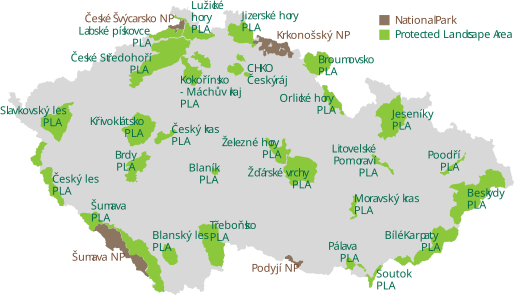
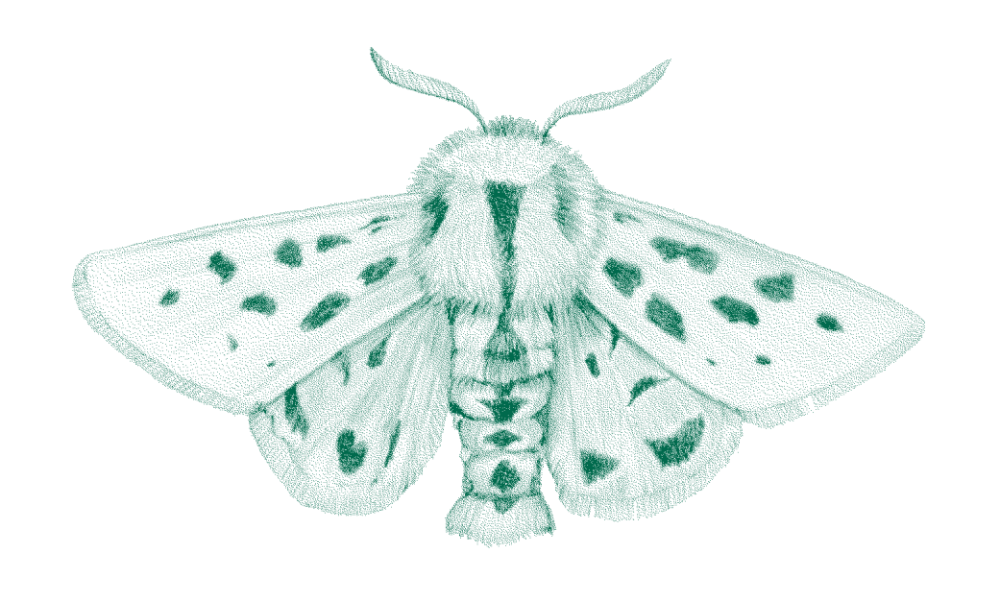

## Where we stand {.aopk-section}

A commissioner of isolated studies, not yet a cumulative capability.

## Opportunistic, Not Systematic

- The NCA commissions **one-off genetic studies** and otherwise consumes isolated project outputs.
- The result is isolated reports: samples not archived comparably, data not deposited under common identifiers, nothing repeatable.
- Other European agencies have named this trap and escaped it.

## Three Strands, Three Different Problems {.smaller}

- **Reference genomes** (ERGA, BGE+) – built by others at European scale. We contribute samples and name priority species. *Cost to us: very low.*
- **Barcode reference libraries** (iBOL / BOLD; the German GBOL model) – partial for Central-European insects, with large gaps in dark taxa. *Low to medium.*
- **Population-genetic monitoring** ($N_e$ 500 and Populations Maintained, under KMGBF Target 4) – indicators are ready and reporting is mandatory. *Low to start, high to sustain.*
- **eDNA and metabarcoding** – the natural bridge to the Biodiversa+ MetaBug pilot, but it needs a working pipeline and library coverage. *Medium to high.*

## The Mandate Already Exists

- **KMGBF Goal A / Target 4** – the $N_e$ 500 indicator is mandatory to report; Populations Maintained is encouraged. Neither requires DNA to begin. *Irrelevant to the insect populations.*
- **EU Nature Restoration Regulation (2024/1991)** – binding pollinator monitoring, method set by Delegated Regulation 2025/2188. *Obligations do not include genetic data.*
- **Habitats Directive Article 17** – space for utilisation of genetic data in the 2031 reporting round through $N_e$? *No obligations for genetic data.*
- **Czech NBSAP 2026–2050 and its Action Plan 2026–2030** – the domestic base for a research–practice interface. *Lack of dedicated genetic monitoring framework or funding.*

## Best-practice national/regional approaches {.aopk-section}

Keeping in mind that the NCA is not a laboratory, and will not build a genetic infrastructure.

## The low-flying butterflies {.aopk-section}

What changes without new resources, or what can be done with a modest investment.

## Low Resource: No New Money, No New Posts

- **Rewrite contract conditions**: every commissioned study must deposit sequences in ENA and barcodes in BOLD, archive vouchers, and return the identifiers to us.
- **Add identifier fields to Species Occurrence Database** – sample ID, BOLD process ID, ENA accession. Link out; host nothing.
- **Designate a focal point** for genome information.
- **Join what already runs** – GINAMO, GENOA, iBOL Europe / BGE+, the EBOCC preparatory action.
- **Archive samples** from 2027, even if analysis is delayed.
- **Other ideas?**

## Medium- and High-Resource Scenarios

::: {.aopk-cols}
::: {}
- **Medium:** one dedicated post; a standing NCA–BC AV ČR–museum working group; a framework contract replacing project-by-project commissioning; an operational metabarcoding pipeline; a voucher and tissue archive arrangement. *Requires project funding, but not a new programme line.*
- **High:** a small conservation-genomics capability on a programme funding line; a national scheme with sentinel species; a mandated biobank. *Requires a new programme line and a new post.*
:::

::: {}

:::
:::

## The 2027 pilot {.aopk-section}

We contribute samples and coordination – not laboratories.

## Start Sampling

::: {.aopk-cols}
::: {}
- The NCA coordinates a network of field expert and long-running monitoring programmes feeding the Species Occurrence Database. It can **collect samples in 2027** without new money, and **archive them for later analysis**.
- **A 2027 baseline cannot be collected in 2032.** Analysis can wait for money; the T₀ time point cannot.
- **Whoever owns the samples writes the conditions** – deposition, identifier return and voucher archiving become enforceable through the transfer agreement.
- The asset we offer partners: a nationally representative, protocol-consistent, precisely georeferenced sample series with clean metadata and clean permits.
:::

::: {}

:::
:::

## Two Tracks, One Field Season {.smaller}

::: {.aopk-cols}
::: {}
- **Track A – selected (regional) action-plan species.** Exhaustive sampling within known populations, during rescue-programme and Natura 2000 visits that already happen. *Are the last populations depleted or isolated? Do reinforcements make sense, and from where?*
- **Track B – selected widespread species.** Stratified, design-based sampling on grid mapping and transects. *Is diversity in common insects tracking fragmentation and climate? What is the national baseline?*
- Field cost in both tracks is near zero: the experts are already at these sites.
:::

::: {}

:::
:::

## What We Must Actually Produce

- **Eight short SOPs**, drafted once in 2026 and reused indefinitely: sampling design and site register, non-lethal tissue sampling, preservation, labelling and metadata, cold chain, permits and ABS, chain of custody, field QC.
- **An identifier spine**: sample IDs minted centrally and pre-printed before the season – one tube = one Species Occurrence Database record = one `materialSampleID`.
- **Adopt the ERGA sample manifest** as our field-form schema rather than designing one.
- Training for 30–40 field experts, with an autumn 2026 dry run to break the protocol before it matters.
- Roughly **2,500–3,000 labelled samples** – the number to put in front of any prospective analysis partner.

## Three-Tier Proposal {.smaller}

- **Tier 0 – Bank only.** No external funding: full sampling, full metadata, archive only. $N_e$ 500 and PM still reported from census data.
- **Tier 1 – Barcode.** A small in-kind or BGE+ slot: barcoding of a subset, BINs returned to Species Occurrence Database, the identifier plumbing tested end to end.
- **Tier 2 – Population genomics.** A partner-led grant: reduced-representation sequencing, a ΔH / ΔF~ST~ baseline, genetic $N_e$ at deliberately over-sampled sites.
- The framing to accept explicitly: **Tier 0 is still a success.**

## From samples to EBVs {.aopk-section}

The pilot only matters if it compiles into something reportable.

## Compiling the Genetic Composition EBVs {.smaller}

- The EBOCC roadmap defines 84 Essential Biodiversity Variables, among them the **genetic composition** class – the layer between raw sequences and a policy answer.
- Four variables the pilot feeds, ordered by what it can honestly support:
  - **Genetic diversity (ΔH)** – within-population heterozygosity and allelic richness, from 20–30 individuals per site.
  - **Genetic differentiation (ΔF~ST~)** – among-population structure along the fragmentation gradient.
  - **Populations Maintained** – computable now, from occurrence and Red List data alone.
  - **Effective population size ($N_e$)** – census-based from day one; genetic $N_e$ a stretch goal at over-sampled sites.
- Each EBV is recomputed at a fixed interval. That is what turns a baseline into a time series.

## Sharing the data {.aopk-section}

One simple dashboard, built on pointers rather than a repository.

## A Simple Dashboard, Not a Data Centre {.smaller}

- The failure mode is not a bad pilot; it is a good pilot whose results arrive as a PDF nobody is obliged to act on. A dashboard is the cheapest fix.
- **What it holds:** the site register with fixed coordinates and resampling intervals; sample counts by species, track and stratum; the identifier chain – sample ID → BOLD BIN → ENA accession – as outbound links; the four EBVs with their time points; permit and ABS status per batch.
- **What it does not hold:** sequences. Those stay in ENA and BOLD, where they belong.
- **Sensitivity:** full precision retained internally, deliberately generalised coordinates in anything published, and the generalisation documented so it reads as intentional rather than sloppy.

## Who the Dashboard Is For

- **Field experts** see what their season produced, and what is still missing from their stratum.
- **Action-plan coordinators** see, per population, whether a pre-agreed decision rule has been triggered.
- **Reporting staff** export the indicator tables directly, instead of reconstructing them each cycle.
- **Partners and the public** see a curated, sensitivity-filtered view – which doubles as the route by which Czech DNA-derived occurrence records finally reach the international layer.

## Takeaways

- **Change the contract clause first** – mandatory deposition, standard identifiers, voucher archiving. It costs nothing and converts reports into assets.
- **Sample in 2027 regardless of funding.** The archive is the irreplaceable part.
- **Bind the identifiers in the field**, not afterwards – the retrofit is unaffordable.
- **Compile the genetic EBVs from what we already hold**, and let the reporting cycle force the recomputation.
- **Publish it simply**: a dashboard that links out, masks what must be masked, and makes the next resampling obvious.

## {.aopk-closing}

::: {.aopk-mission}

**THANK YOU FOR YOUR ATTENTION!**

:::

::: {.aopk-lockup}

:::

::: {.aopk-web}
aopk.gov.cz
:::
