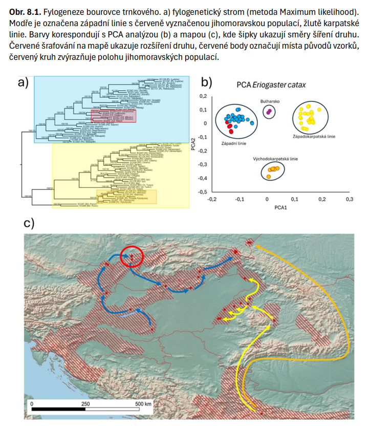
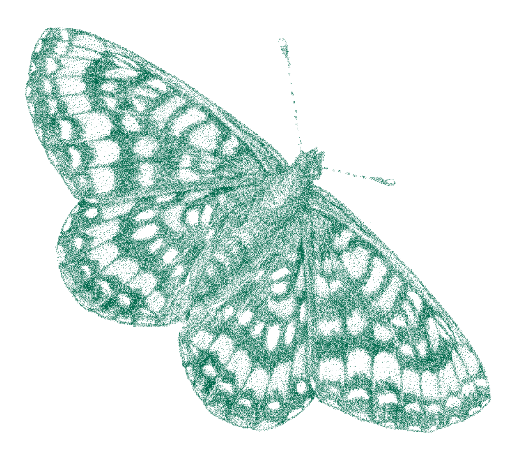

## Where we stand {.aopk-section}

One-off studies today; a strategic mandate for a standing system.

## Current State: What the NCA Does

::: {.aopk-cols}
::: {}
- The NCA currently lacks a standardised, long-term national monitoring system for genetic diversity.
- It focuses primarily on **one-off genetic studies** for selected groups of species.
- Data collection is project-specific and often linked to active species conservation and applied research.
- Genetic characterisation answers immediate management questions rather than building a continuous time series.
:::

::: {}

:::
:::

## The Strategic Mandate {.smaller}

- **Kunming-Montreal Framework (CBD, 2022):** Goal A requires genetic diversity to be maintained so populations retain their adaptive potential; Target 4 requires it to be maintained and restored within and between populations of native wild species.
- **The Objective:** Translate this strategic need into a unified, long-term monitoring system.
- **Targeted Approach (IUCN, 2022):** Not all species require monitoring. The focus should be on systematic selection by conservation relevance, feasibility of sampling, and the ability to influence decision-making.
- Transition from ad-hoc projects to methodologically comparable, repeated monitoring over time.

## Cases: Czech butterflies {.aopk-section}

What genetic data have already told us, and what they changed.

## Case: Euphydryas maturna {.smaller}

::: {.aopk-cols}
::: {}
- The **scarce fritillary**: a microsatellite study (2023) combining **historical and recent samples**.
- **Trend:** variability in the Dománovice / Elbe-lowland population has **declined**, and the population is markedly distinct from those in neighbouring countries.
- **Origin:** the population near Frýdek-Místek is **not autochthonous** – the data point to southern Slovakia.
- Decision-grade evidence: the result feeds directly into **genetic management** choices.
:::

::: {}

:::
:::

## Natura 2000 Butterflies

- Assessment of genetic conditions in **current and historical populations** of butterflies of European importance, with a proposal for future genetic management of those populations.
- **Microsatellites (SSR)** for seven species – *Lycaena helle*, *Coenonympha hero*, *Colias myrmidone*, *Parnassius mnemosyne*, *Phengaris arion*, *P. nausithous* and *P. teleius* – with present-day parameters compared against the same populations in the past.

## From Markers to Genomes {.smaller}

::: {.aopk-cols}
::: {}
- **RADseq** to assess the standing and condition of current populations of *Eriogaster catax* and *Euplagia quadripunctaria*.
- **Ongoing, 2024–2026:** *Genomics for insect conservation in the CR: butterflies as a model group*, a TA ČR project with the NCA as application guarantor.
- The step from single-species studies to testing genomic approaches across practical invertebrate conservation.
:::

::: {}

:::
:::

## Precedents from Abroad {.smaller}

- **Switzerland, genomic pilot:** five species including the fritillary *Melitaea diamina*; over **1,200 individuals from 158 populations** by proportional stratified random sampling, with reference genomes and whole-genome resequencing.
- Historical collection samples for two of the five species allowed change to be assessed **retrospectively** – museum material as a baseline.
- **BGEMS, a common species as sentinel:** **1,024** meadow browns (*Maniola jurtina*) from **15 sites** in southern England, **2012–2019**, a true annual series at three of them, extended across **ten countries** through existing butterfly monitoring schemes.
- Both convert whole-genome data into indicators an agency can act on: diversity, connectivity, inbreeding and $N_e$.

## What monitoring could deliver {.aopk-section}

Where to pilot it, and what it should be asked to answer.

## Options for Pilots: Species Action Plans

- **Species Action Plans (SAPs) and Regional Species Action Plans (RSAPs)** offer ideal pilot frameworks.
- Focus on populations undergoing reintroductions, reinforcements, or other active manipulations.
- **Core Principle:** The genetic relevance of every SAP and RSAP should be explicitly assessed.
- Genetic data must serve as a **long-term indicator of success**, evaluated alongside demographic trends and habitat conditions.

## Potential Objectives of the NCA

- **Indicator of Success:** Utilising genetics to evaluate the efficacy of SAPs and RSAPs.
- **Standardisation & Biobanking:** Implementing minimum standards for metadata and the long-term preservation of biological material.
- **Risk Screening:** Using demographic and spatial proxies to identify populations at genetic risk.
- **Genetic Baselines:** Establishing reference genetic states for priority species.
- **Repeated Monitoring:** Tracking changes in effective population size ($N_e$), inbreeding, and connectivity over time.

## How to deliver it {.aopk-section}

The capacity already exists – and a minimum scheme to put it to work.

## NCA Capacities: A Nationwide Sampling Network

::: {.aopk-cols}
::: {}
- The NCA possesses a **unique nationwide field network** and deep knowledge of local habitats.
- Existing long-term field monitoring infrastructure can be leveraged for low-cost, standardised sample collection (highly effective for invertebrates).
:::

::: {}

:::
:::

## Biobanking and the Division of Labour

::: {.aopk-cols}
::: {}
- **NCA Role:** Prioritisation, sampling coordination, metadata standardisation, biobanking, and management application.
- **External Partners (Universities/CAS):** Laboratory processing, bioinformatics, and methodological design.
:::

::: {}

:::
:::

## Recommended Minimum Scheme

- **Explicitly assess genetic relevance** for all SAPs and RSAPs.
- **Standardise sampling, metadata, and long-term archiving** (biobanking), even if sequencing occurs at a later date.
- **Utilise existing field monitoring networks** for repeated biological sampling.
- **Combine approaches:** Use a narrow portfolio of genomically monitored species alongside a broader proxy-based screening of genetic risk.
- **Pre-define protocols:** Establish indicators, repetition intervals, and specific decision-making responses in advance.

## Takeaways

- Make genetic relevance an **explicit step** in every SAP and RSAP, not an optional extra.
- **Standardise and archive now**; sequencing can follow later.
- **Sample through the network that already exists** – the field monitoring infrastructure is the cheapest route to standardised material.
- **Pair depth with breadth:** genomic monitoring of a few species, proxy screening of many.
- **Decide the response before the data arrive** – indicators, intervals and consequences, agreed in advance.

## Thank you {.aopk-section}

Questions and comments are welcome.

## {.aopk-closing}

::: {.aopk-mission}

**THANK YOU FOR YOUR ATTENTION!**

:::

::: {.aopk-lockup}

:::

::: {.aopk-web}
aopk.gov.cz
:::
