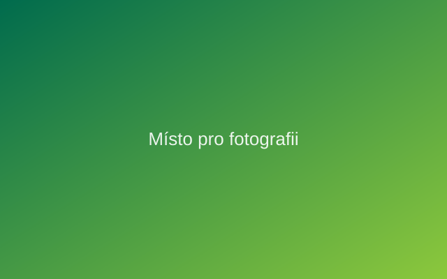

## Titulek

- Lorem ipsum dolor sit amet
- Consectetur adipiscing elit
- Sed do eiusmod tempor
- Ut enim ad minim veniam
- Quis nostrud exercitation ullamco
- Duis aute irure dolor
- Excepteur sint occaecat cupidatat
- Sunt in culpa qui officia

## Titulek s obrázkem

::: {.aopk-cols}
::: {}
- Lorem ipsum dolor sit amet
- Consectetur adipiscing elit
- Sed do eiusmod tempor
- Ut enim ad minim veniam
- Quis nostrud exercitation
:::

::: {}

:::
:::

## Titulek s odstavcem

::: {.smaller}
Lorem ipsum dolor sit amet, consectetur adipiscing elit, sed do eiusmod
tempor incididunt ut labore et dolore magna aliqua. Ut enim ad minim veniam,
quis nostrud exercitation ullamco laboris nisi ut aliquip ex ea commodo
consequat. Duis aute irure dolor in reprehenderit in voluptate velit esse cillum
dolore eu fugiat nulla pariatur. Excepteur sint occaecat cupidatat non proident,
sunt in culpa qui officia deserunt mollit anim id est laborum.
:::

## Oddíl prezentace {.aopk-section}

Bílé logo na firemní tmavě zelené barvě (manuál s. 6–7).

## Ukázka prvků

Barvy jednotného vizuálního stylu:

| Barva | CMYK | RGB | Pantone |
|-------|------|-----|---------|
| tmavě zelená | 100/30/80/25 | 0/107/77 | 342 |
| žlutá | 0/18/100/0 | 255/205/0 | 116 |
| světle zelená | 50/0/100/0 | 140/200/60 | 376 |
| oranžová | 0/55/100/0 | 246/139/31 | Orange 021 |
| šedá | 35/27/25/0 | 177/177/177 | Cool Gray 7 |

## {.aopk-closing}

::: {.aopk-mission}
**Zajišťujeme** odbornou i praktickou péči o naši přírodu a krajinu. 
**Spravujeme** 25 chráněných krajinných oblastí a více než
200 národních přírodních rezervací a památek. 
**Chráníme** vzácné a ohrožené druhy rostlin a živočichů. 
**Ukazujeme** krásy přírody lidem.
:::

::: {.aopk-lockup}

:::

::: {.aopk-web}
aopk.gov.cz
:::
